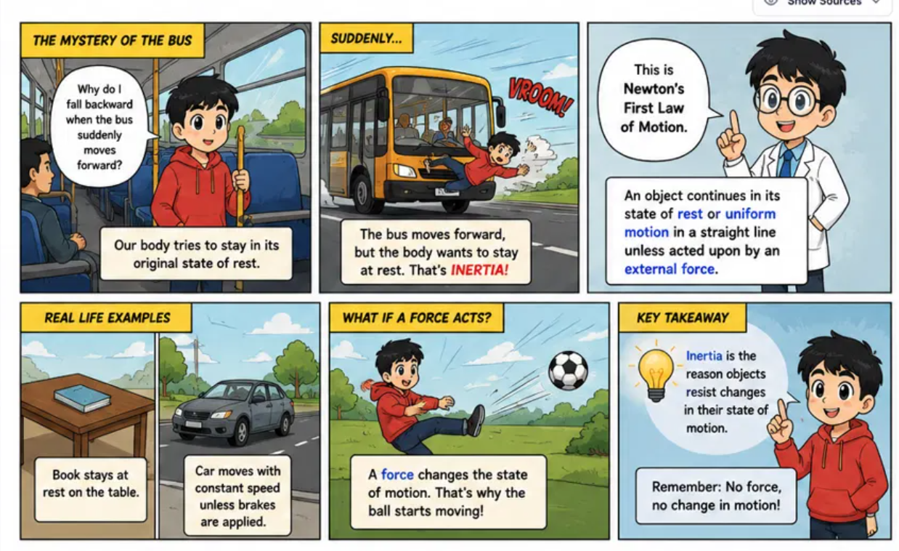
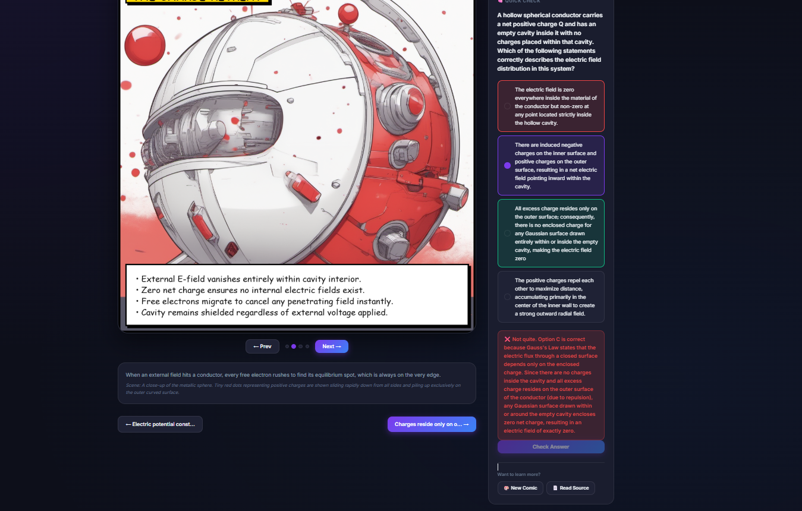
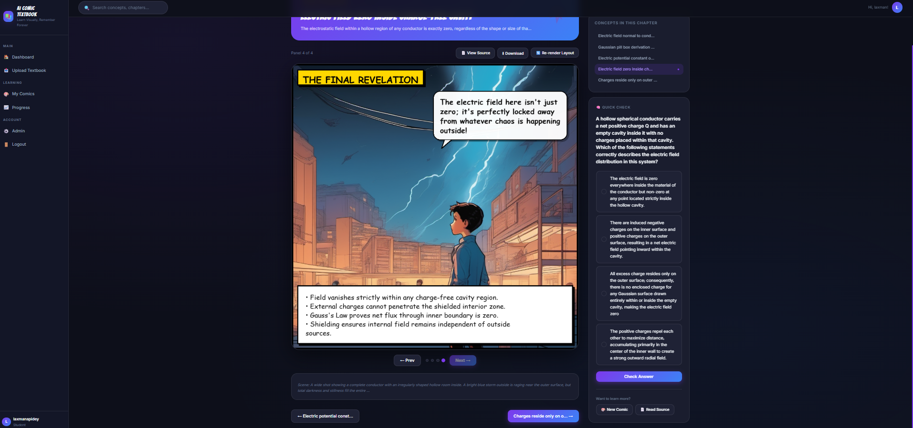
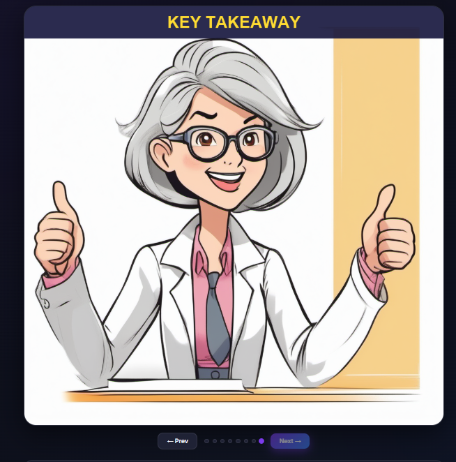

# 📚 EduComic AI: Textbook-to-Comic Learning Platform

**EduComic AI** is a revolutionary open-source platform that automatically transforms dense, boring PDF textbooks into engaging, highly visual, and interactive comic books using cutting-edge Generative AI. 

By leveraging Local LLMs (Ollama) and Stable Diffusion (ComfyUI), this platform completely localizes and automates the educational pipeline—from PDF extraction and curriculum planning to true comic-style rendering and interactive student assessments.

---

## ✨ Features

- **📄 Automatic PDF Ingestion & Chunking**: Upload any textbook, and the system extracts text, chunks it, and indexes it into a local ChromaDB vector store for highly accurate semantic search (RAG).
- **🧠 Automated Curriculum Planning**: An AI Curriculum Agent automatically analyzes chapters and logically divides dense text into bite-sized, learnable "Concepts" or topics.
- **🎨 True Comic Book Rendering**: 
  - **Storyboard Generation**: AI automatically writes scene descriptions and dialogues based on educational concepts.
  - **Image Generation**: Integrates with ComfyUI and Stable Diffusion to generate stunning background art.
  - **Dynamic Comic Layouts**: Features a custom panel composer that natively overlays clean white speech bubbles, caption boxes, and formula boxes directly onto the generated art—with absolutely no visual artifacts.
- **📝 10-Question Interactive Quizzes**: For every concept, the AI generates a comprehensive 10-question multiple-choice quiz to test the user's understanding.
- **📈 Progress Dashboard**: A built-in student dashboard tracks quiz scores per topic with color-coded mastery metrics (Green, Yellow, Red) and an interactive quiz slider UI.
- **🔒 100% Local Processing**: Designed to run entirely locally using Ollama and ComfyUI. No API keys required, ensuring complete data privacy.

---

## 🖼️ Gallery / Demonstrations

Here are some examples of textbooks transformed into stunning comics:

<!-- Placeholders for your 4 demonstration images -->





---

## 🚀 Tech Stack

- **Backend**: Django (Python)
- **Database**: SQLite / PostgreSQL (Django ORM)
- **Vector Store**: ChromaDB
- **Asynchronous Workers**: Django-Q (Background task processing)
- **Local LLM**: Ollama (e.g., Qwen, Llama 3)
- **Image Generation**: ComfyUI (Stable Diffusion)
- **Frontend**: HTML5, Vanilla JavaScript, CSS (Custom styling)

---

## 🛠️ Installation & Setup

### Prerequisites
- Python 3.10+
- [Ollama](https://ollama.ai/) installed and running locally with your preferred model (e.g., `ollama run qwen2:7b`).
- [ComfyUI](https://github.com/comfyanonymous/ComfyUI) installed and running locally with API mode enabled.

### 1. Clone the repository
```bash
git clone https://github.com/yourusername/EduComic-AI.git
cd EduComic-AI
```

### 2. Set up the virtual environment
```bash
python -m venv venv
# Windows
.\venv\Scripts\activate
# Linux/Mac
source venv/bin/activate
```

### 3. Install dependencies
```bash
pip install -r requirements.txt
```

### 4. Apply migrations and start the Web Server
```bash
python manage.py makemigrations
python manage.py migrate
python manage.py runserver
```

### 5. Start the Background Worker
In a separate terminal, start the Django-Q worker to process the heavy AI tasks (PDF extraction, LLM curriculum generation, and ComfyUI image rendering):
```bash
# Windows
.\start_worker.bat
# Or manually:
python manage.py qcluster
```

---

## 💡 How It Works

1. **Upload**: The user uploads a PDF textbook via the Dashboard.
2. **Process**: The background worker chunks the text and uses the LLM to identify key educational concepts.
3. **Generate Quizzes**: 10 multiple-choice questions are immediately generated for every concept.
4. **Generate Comics**: When the user clicks "Generate Comic" on a concept, the Storyboard Agent creates scenes, ComfyUI renders the art, and the Panel Composer overlays the educational text and dialogue in a true comic-book style.
5. **Learn**: The user reads the comic, takes the interactive quiz, and tracks their progress!

---

## 🤝 Contributing

Contributions are welcome! Please feel free to submit a Pull Request or open an Issue to discuss potential features, bug fixes, or improvements.

## 📄 License

This project is licensed under the MIT License.